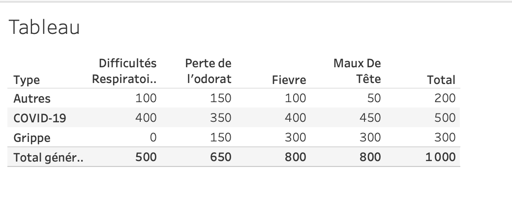

# La classification de Naive Bayes

##  Introduction

La classification Naive Bayes est un ensemble d'algorithmes couramment utilisé dans l'apprentissage automatique. II s'agit d'une collection d'algorithmes de classification basés sur le théorème de Bayes. Son objectif est donc de pouvoir résoudre les problématiques de classification dont on fait face dans la vie courante en se basant sur des variables totalement indépendantes entre elles, d'où son appellation "Naif". L'une de ses applications les plus connues est le filtre anti-spam.
Pour mieux comprendre son fonctionnement, dans la suite de cet article, nous ferons dans un premier temps un zoom sur la loi de Bayes, puis nous expliquerons son fonctionnement avec des exemples succincts.

## La loi de Bayes

La loi de Bayes se définit par la formule suivante :
$$
P(A \mid B)=\frac{P(B \mid A) * P(A)}{P(B)}
$$
avec $A$ et $B$ des événements, $P(A)$ la probabilité de $A$ et $P(A \mid B)$ la probabilité conditionnelle de A sachant B.

Pour mieux expliquer ce phénomène, nous allons utiliser les circonstances sanitaires actuelles pour lesquelles les tests de dépistage Covid-19 sont devenus ordinaires. Nous allons supposer les faits suivants :

- 1 personne sur 1000 attrape le covid-19
- La précision du test génique PCR est de $99 \%$

Une personne devant voyager décide de faire le test recommandé et malheureusement se retrouve avec un test positif. Quelle est la probabilité qu'elle soit vraiment porteuse du covid-19? 
On serait tout de suite tenté de dire qu'elle est très forte $(\mathrm{P}>50 \%)$ au vu de la précision du test. Pourtant, la probabilité à priori fausse totalement cette pensée.

\newpage
Si on est d'avance certain de ne pas avoir le virus, le fait d'avoir un résultat positif fait d'avantage penser qu'on est dans les $1 \%$ de marge d'erreur et pas le contraire. C'est donc pour cela qu'il est nécessaire de prendre en compte la probabilité à priori qui est dans notre cas, 1 personne sur 1000 contracte le virus. La bonne démarche est la suivante :

Soit A l'évènement avoir le covid-19. B l'évènement résultat de test positif $P(A)=0,001$
$P(B \mid A)=0,99$
Avec $\overline{\text { A }}$ complémentaire de $\mathrm{A},$ on a
$$
\begin{array}{r}
P(B)=P(B \mid A) * P(A)+P(B \mid \bar{A}) * P(\bar{A}) \\
P(B)=0,99^{*} 0,001+0,01^{*} 0,999 \\
P(B) \equiv 0,01098 \\
P(A \mid B)=\frac{P(B \mid A) * P(A)}{P(B)}=\frac{0,99 * 0,001}{0,01098} \cong 0,090 \text { soit } 9 \%
\end{array}
$$
On se rend compte que la probabilité d'avoir le virus sachant que le test est positif est de $9 \%,$ et qu'il est très faible par rapport à la pensée eue de prime abord.

## Exemple d'Application de Naives Bayes

Partant de l'exemple exposé ci-dessus, la particularité de l'algorithme de Naives Bayes est qu'elle s'applique à plusieurs variables indépendantes entre elles, ce qui complexifie un peu le calcul de la probabilité. La formule dans ce cas est:
$$
\mathrm{P}(\mathrm{C} \mid F 1, \ldots, F n)=\frac{\mathrm{P}(\mathrm{C}) * \mathrm{P}\left(\left.\mathrm{C}\right|_{F 1, \ldots, F n}\right)}{\mathrm{P}(F 1, \ldots, F n)}
$$
où C est  une variable de classe dépendante dont les instances ou classes sont peu nombreuses, conditionnée par plusieurs variables caractéristiques $F_{1}, \ldots, F_{n}$

Pour l'exposer, je vous propose cet ensemble qui va dans le même contexte de crise sanitaire.
Ici nous avons un jeu de données sur 1000 personnes atteintes de différentes maladies. On dispose de trois types: Covid-19, Grippe et "autre". Pour chaque maladie, on a 3 caractéristiques:

- Si la personne a des symptômes de Difficultés respiratoires
- Si la personne a des symptômes de Perte de l'odorat
-	Si la personne a de la Fièvre
-	Si la personne a des Maux de tête

Le but de ce jeu de données est de prédire la maladie d'une personne en fonction de ces différents symptômes.

Une personne veut qu'on lui prédise la maladie qu'elle a en tenant compte de ces symptômes:

- II a des difficultés respiratoires                 on convient de l'appeler Rs
- II a perdu l'odorat                                on convient de l'appeler Od
- II a de la fièvre                                  on convient de l'appeler Fv

Pour savoir de quelle maladie il s'agit, on se doit de calculer

$-\mathrm{P}($ Covid $-19 \mid R s, 0 \mathrm{~d}, F v)$ la probabilité que ce soit le covid-19 sachant que les symptômes sont Rs, Od et Fv 

$-P($ Grippe $\mid R s, O d, F v)$ la probabilité que ce soit le covid-19 sachant que les symptômes sont Rs, Od et Fv

$-P($ Autres $\mid R s, O d, F v)$ la probabilité que ce soit le covid-19 sachant que les symptômes sont Rs, Od et Fv

En appliquant la formule de Bayes on a

$$
\mathrm{P}(\text { Covid }-19 \mid R s, 0 \mathrm{~d}, F v)=\frac{\mathrm{P}(\text { Covid }-19) * \mathrm{P}(Rs \mid \text { Covid }-19)) * \mathrm{P}(O d \mid \text { Covid }-19) * \mathrm{P}(F v \mid \text { Covid }-19)}{\mathrm{P}(Rs) * \mathrm{P}(O d) * \mathrm{P}(F v)}
$$
On a également 

$\mathrm{P}($ Covid -19$)=\frac{\operatorname{card}(\operatorname{Covid}-19)}{\text { card }(\text { tous les cas })}=\frac{500}{1000}=0,5$

$\mathrm{P}($ Grippe $)=0,3$

$\mathrm{P}($ Autres $)=0,2$

$P(R s)=0,5$

$P(O d)=0,65$

$P(E V)=0,8$

On peut calculer désormais

$\mathrm{P}(R s \mid$ Covid -19$)=\frac{\operatorname{card}(\operatorname{Covid}-19 e t \mathrm{Rs})}{\operatorname{card}(\operatorname{covid}-19)}=\frac{400}{500}=0,8$

$P(O d \mid$ Covid -19$)=0,7$

$P(F v \mid$ Covid -19$)=0,8$

Maintenant qu'on a toutes nos probabilités on peut calculer :

$\mathrm{P}($ Covid- $19 \mid R s, 0 \mathrm{~d}, F v)=\frac{0,5 * 0,8 * 0,6 * 0,8}{0,5 * 0,65 * 0,8}=0,73$

Egalement, on a:

$\mathrm{P}\left(\right.$ Grippe $\left.\left.\right|_{R s}, 0 \mathrm{~d}, F v\right)=0$

$\mathrm{P}\left(\right.$ Autre $\left.\left.\right|_{R s}, \mathrm{Od}, F v\right)=0,14$

On remarque que la probabilité que notre personne soit porteuse du Covid-19 est largement plus grande que les autres. On classifie notre individu inconnu comme étant porteuse du Covid

## Les avantages et limites de L’algorithme Naïve Bayes

Les avantages d'un tel algorithme sont nombreux. Nous pouvons cependant toutefois mettre en exergue ceux-là :

- Il est relativement simple à comprendre et n'exige aucune volumétrie de données : il pourrait s'appliquer même s'appliquer aux petits jeux de données

- Il est très rapide pour les enjeux de classification et pas très couteux.

La limite majeure de cet algorithme est la nécessité d'indépendance entre les variables mises en jeu. Malheureusement, dans la plupart des cas, cette exigence est bafouée.

## Bibliographie

https://le-datascientist.fr/les-algorithmes-de-naives-bayes
https://fr.wikipedia.org/wiki/Classification_naïve_bayésienne
https://mrmint.fr/naive-bayes-classifier
https://www.kdnuggets.com/2020/06/naive-bayes-algorithm-everything.html
https://www.youtube.com/watch?v=O2L2Uv9pdDA
https://www.lamsade.dauphine.fr/~atif/lib/exe/fetch.php?media=teaching:knn_naivebayes.pdf

